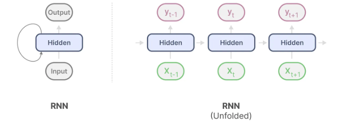
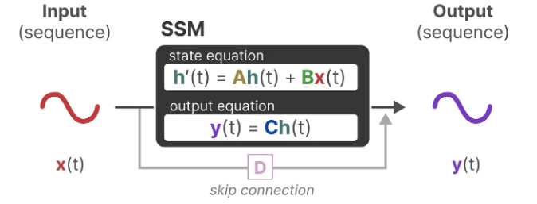
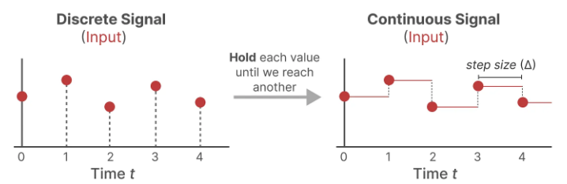
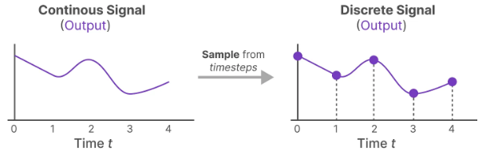
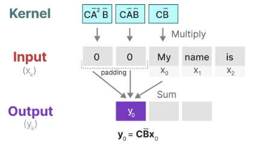
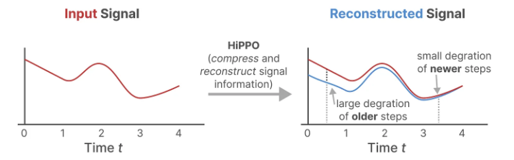
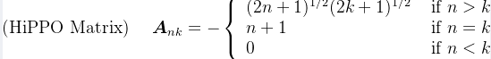

# Mamba
[相关知识链接](https://blog.csdn.net/v_JULY_v/article/details/134923301)

## 0. 前言
Mamba 如何从 SSM，HiPPO，S4 演变过来：
### 0.0 RNN
RNN：每一个时刻$t$的隐藏状态$h_t$都是基于当前的输入$x_t$和前一个时刻的状态$h_{t-1}$计算得到的，$h_t=\tanh{(Wh_{t-1}+Ux_t)}$. 然后，根据新计算得到的状态$h_t$输出$y_t$。


**RNN就是SSM（State Space Model）**。
RNN存在的问题：
+ 容易忘记早期的信息；
+ 因为每个时间步必须等待上一个时间步的输出，故没法并行训练，推理快训练慢。

### 0.1 SSM
SSM假设动态系统可以通过两个方程从其在时间t的状态进行预测：
**连续时间下，**
状态方程：$h'(t)=Ah(t)+Bx(t)$
输出方程：$y(t)=Ch(t)+Dx(t)$



A,B,C,D是可以学习到的，训练后固定不变。
A: 系统记忆；
B：输入如何影响状态；
C：如何从状态读出输出；
D：输入如何影响输出。

### 0.2 S4
SSM到S4，主要进行了以下改造：
+ 离散化SSM，加入步长参数$\Delta$；
+ 循环表示；
+ 卷积表示；
+ 基于HiPPO处理长序列；

#### 0.2.0 离散化：零阶保持技术 ZOH, Zero-Order hold technique
零阶保持技术 Zero-order hold technique：
1. 首先，每次收到离散信号，**保持其值**到下一次收到新的离散信号。

2. 保持该值的时间，称为**步长**--$\Delta$，可学习。也就是采样间隔时间。
3. 有了连续的输入，就有连续的输出。才使用$\Delta$进行采样。


> 同样的$\Delta$，也对A,B进行采样：
> $\overline{A}=\exp{(\Delta A)}$
> $\overline{B}=(\Delta A)^{-1}(\exp{(\Delta A)}-I)\cdot \Delta B$

> 只是在训练的时候，将连续的参数离散化。

#### 0.2.1 循环结构表示
主要目的是为了**快速推理**。
SSM可以直接用RNN结构。

#### 0.2.2 卷积结构表示
方便**并行训练**。
图像中一般使用2D的卷积核，文本序列就降维到**1D的卷积核**。

S4 通过由四个参数$\Delta,A,B,C$定义，以下公式表示 S4 如何实现从序列到序列的变换：
连续信号的公式：
$h'(t)=Ah(t)+Bx(t)$
$y(t)=Ch(t)$
将连续信号离散化：
$h_t=\overline{A}h_{t-1}+\overline{B}x_t$
$y_t=Ch_t$
输出的最后表示：
$y=x*\overline{K}$
$\overline{K}=(C\overline{B},C\overline{AB},\dots,C\overline{A}^{K}\overline{B},\dots)$

则1D卷积核的参数则可以用$\overline{K}$的元素填充：
$\overline{K}=(C\overline{B},C\overline{AB},\dots,C\overline{A}^{K}\overline{B},\dots)$(将SSM表达式展开，取每一项的系数就是卷积核的参数)



**A,B,C在SSM中都是常数，故可以预先计算出该卷积核**。

表示为卷积核后，可以进行并行训练，但是**内核大小固定**，推理不如RNN快速。

为了进一步加速，推理用RNN，训练用CNN。


#### 0.2.3 长距离依赖问题
根据上面的公式，可以发现K决定了模型参考之前多少个tokens。但是$C\overline{A}^{K}\overline{B}$存在衰减。

Q: 如何决定是快衰减还是慢衰减？
A: 取决于**A的特征值**。若A可对角化$A=VΛV^{−1},Λ=diag(λ_1​,…,λ_n​)$，那么$K=C\overline{A}^k\overline{B}=CVΛ^kV^{−1}B$
特征值远小于1，经过k次幂，就会很快趋向于1；慢衰减就是接近1；无衰减就是等于1；震荡记忆，特征值为复数。

Q：那可以直接使用特征值$\lambda=1$的矩阵A，让模型具备长期记忆能力？
A：不可以，存在一些问题。
+ 推理输出容易震荡；
+ 学习难度大，也要学会该遗忘什么，需要的是选择性保留；
+ 缺乏多尺度时间，模型也需要学习短期的结构。

**为了解决长距离依赖问题，采用HiPPO**（High-order Polynomial Projection Operator）,HiPPO矩阵用于**连续时间信号**投影到**正交多项基**下，以代表过去的状态/信息。解决了如何在有限的存储空间中有效地解决序列建模的长距离依赖问题。

HiPPO将当前看到的所有输入信号**压缩**为一个**系数向量**。

HiPPO使用矩阵A构建一个可以**很好地捕获最近的token并衰减旧的token**的状态表示。通过**函数逼近**产生状态矩阵A的最优解，公式如下：

其实，A就是下三角矩阵。HiPPO矩阵可以产生一个**隐藏状态**来记住历史，从而可以处理**远程依赖性**。

#### 0.2.4 S4, Structed State Space for Sequences
S4，序列的结构化状态空间，综合了SSM+离散化+HiPPO。

### 0.3 S4D
**为了追求更高的效率和简洁性**，S4D，将参数矩阵标准化为对角结构（Diagonal），S4的对角版本。

S4的状态矩阵A的**结构复杂**，即为DPLR（Diagonal Plus Low-Rank），一个对角矩阵+一个低秩矩阵。HiPPO矩阵，即状态矩阵A，使用NPLR（非正定低秩）表示：
$$A=VΛV^*-PQ^T=V(Λ-(V^*P)(V^*Q)^*)V^*$$
V，列向量相互垂直，即酉矩阵；
Λ，对角矩阵；
P，Q是低秩矩阵，可以被少数几个向量的乘积表示。

S4D发现对于许多任务，可以直接去掉低秩部分$-PQ^T$，只保留对角部分。

## 1. Mamba：Selective State Spaces 可选择的状态空间

使用**Selective State Spaces**进行**线性时间建模**.

### 1.1 动机
Time-varying SSMs（State Space Models，状态空间模型）计算耗时随时间变化，不能使用卷积，且**计算效率低**。
自回归推理的模型需要对整个内容进行计算，$O(n^2)$。
循环模型是高效的，因为其有限的状态，时间常量推理以及线性时间训练。但是模型的**性能受到上下文压缩程度的限制**。

Selective Copying task和Induction Heads task都需要模型具备理解内容的能力，通过这两个任务体现LTI（linear time invariance，线性时间不变）模型只能完成好标准复制任务，卷积只对时间感知（也即距离），而不需要理解内容，所以不能完成好选择性复制任务。在选择性复制任务中，输入和输出之间的距离是可变的，不能通过**静态卷积核**建模。
>Selective Copying task:
>+ 标准复制任务为了测试模型的记忆能力。
>+ 选择复制任务为了测试模型的抗干扰能力。
>
>Induction Heads task 归纳头任务:
>测试大语言模型LLM的情境学习（in-context learning）能力。
>+ 联想回忆和复制能力。根据上下文推理，知道在特定语境下产生正确的输出。

**序列建模如何有效地将上下文压缩到一个小的状态中？该状态具备的特性：小（高效）且具备必要的信息（有效）。**
这就需要模型具备选择的能力。

### 1.2 解决方法
+ 使用选择机制；
+ 使用一个简单的SSM，提出**硬件感知算法**，利用了显存层次结构，**不需要注意力块、MLP块**。

#### 1.2.1 选择机制
让SSM的参数$\Delta$、B、C随输入而变化。

**Q: 如何让参数$\Delta$BC随输入变化？**
A：每个参数都通过神经网络$s_B(x)=\mathbf{Linear_N}(x),s_C(x)=\mathbf{Linear_N}(x)$,$s_{\Delta}(x)=\mathbf{Broadcast}_D(\mathbf{Linear_1}(x))$得到。

**但是遇到新的问题**，当参数$\Delta,B,C$依赖输入时，其维度由S4$的(D,N)$变成了$(B,L,N)$，其中$L$就是随输入变化的，$\overline{K}=(C\overline{B},C\overline{AB},\dots,C\overline{A}^{K}\overline{B},\dots)$的元素随输入变化，从而**不能使用卷积，导致计算效率低下**。


#### 1.2.2 硬件感知算法：加速
为了解决因为参数依赖输入导致的不能使用卷积加速的问题，作者采用硬件感知算法解决这个问题。

因为传统的实现会把**整个状态**放在**显存**上，IO成本高。大多数操作其实不是算力瓶颈而是**显存带宽瓶颈**。所以，着重**减少内存IO**能够减少能够加速SSM。如何减少IO？作者提出硬件感知算法实现。


硬件感知算法使用了三个经典技术：
##### 1.2.2.1 内核融合
 **内核融合**：减少对GPU慢速内存HBM的读写次数，将**计算放在高速缓存SRAM上**。
    + 将SSM参数$(\Delta, A, B, C)$加载到SRAM中；
    + 在SRAM中完成参数离散化(生成$Ā,B̄$)，并行扫描，以及与矩阵C的乘法等所有中间计算；
    + 将最终结果y写回HBM。

```cpp
// csrc/selective_scan/selective_scan_fwd_kernel.cuh
template<typename Ktraits>
__global__ __launch_bounds__(Ktraits::kNThreads, Ktraits::kMinBlocks)
void selective_scan_fwd_kernel(SSMParamsBase params) {
    constexpr bool kIsComplex = Ktraits::kIsComplex;
    ...

    // Shared memory (SRAM)
    extern __shared__ char smem_[];
    auto& smem_load = reinterpret_cast<typename Ktraits::BlockLoadT::TempStorage&>(smem_);
    auto& smem_load_weight = reinterpret_cast<typename Ktraits::BlockLoadWeightT::TempStorage&>(smem_);
    auto& smem_load_weight1 = *reinterpret_cast<typename Ktraits::BlockLoadWeightT::TempStorage*>(smem_ + sizeof(typename Ktraits::BlockLoadWeightT::TempStorage));
    auto& smem_store = reinterpret_cast<typename Ktraits::BlockStoreT::TempStorage&>(smem_);
    auto& smem_scan = *reinterpret_cast<typename Ktraits::BlockScanT::TempStorage*>(smem_ + Ktraits::kSmemIOSize);
    scan_t *smem_running_prefix = reinterpret_cast<scan_t *>(smem_ + Ktraits::kSmemSize); 
    ...

    // 定义指向昂HBM中的数据指针
    input_t *u = reinterpret_cast<input_t *>(params.u_ptr) + batch_id * params.u_batch_stride
        + dim_id * kNRows * params.u_d_stride;
    input_t *delta = reinterpret_cast<input_t *>(params.delta_ptr) + batch_id * params.delta_batch_stride
        + dim_id * kNRows * params.delta_d_stride;
    weight_t *A = reinterpret_cast<weight_t *>(params.A_ptr) + dim_id * kNRows * params.A_d_stride;
    weight_t *B = reinterpret_cast<weight_t *>(params.B_ptr) + dim_id * kNRows * params.B_d_stride;
    input_t *Bvar = reinterpret_cast<input_t *>(params.B_ptr) + batch_id * params.B_batch_stride + group_id * params.B_group_stride;
    weight_t *C = reinterpret_cast<weight_t *>(params.C_ptr) + dim_id * kNRows * params.C_d_stride;
    input_t *Cvar = reinterpret_cast<input_t *>(params.C_ptr) + batch_id * params.C_batch_stride + group_id * params.C_group_stride;
    scan_t *x = reinterpret_cast<scan_t *>(params.x_ptr) + (batch_id * params.dim + dim_id * kNRows) * params.n_chunks * params.dstate;

    // 》》》》》》》》》》》》》 离散化计算 》》》》》》》》》》》》》》》》》》》
    // 在循环中，将数据块从HBM加载到寄存器中
    constexpr int kChunkSize = kNThreads * kNItems;
    for (int chunk = 0; chunk < params.n_chunks; ++chunk) {
        intput_t u_vals[kNRows][kNItems], delta_vals_load[kNRows][kNItems];
        __syncthreads();
        #pragma unroll
        for (int r = 0;  r < kNRows; ++r) {
            if constexpr (!kDirectIO) {
                if (r > 0) { __syncthreads(); }
            }
            // cub::BlockLoad, 内存加载原语
            load_input<Ktraits>(u + r * params.u_d_stride, u_vals[r], smem_load, params.seqlen - chunk * kChunkSize);
            if constexpr (!kDirectIO) { __syncthreads(); }
            load_input<Ktraits>(delta + r * params.delta_d_stride, delta_vals_load[r], smem_load, params.seqlen - chunk * kChunkSize);
        }
        u += kChunkSize;
        delta += kChunkSize;


        float delta_vals[kNRows][kNItems], delta_u_vals[kNRows][kNItems], out_vals[kNRows][kNItems];
        #pragma unroll
        for (int r = 0; r < kNRows; ++r) {
            #pragma unroll
            for (int i = 0; i < kNItems; ++i) {
                float u_val = float(u_vals[r][i]);
                delta_vals[r][i] = float(delta_vals_load[r][i]) + delta_bias[r];
                if (params.delta_softplus) {
                    // 在寄存器中对delta进行softplus计算
                    delta_vals[r][i] = delta_vals[r][i] <= 20.f ? log1pf(expf(delta_vals[r][i])) : delta_vals[r][i];
                }
                delta_u_vals[r][i] = delta_vals[r][i] * u_vals;
                out_vals[r][i] = D_val[r] * u_val;
            }
        }
        __syncthreads();

        ...
        #pragma unroll
        for (int r = 0; r < kNRows; ++r) {
            if (r > 0) { __syncthreads(); }
            scan_t thread_data[kNItems];
            #pragma unroll
            for (int i = 0; i < kNItems; ++i) {
                if constexpr (!kIsComplex) {
                    // exp2f(delta * A), 这里就是计算 Ā
                    thread_data[i] = make_float2(exp2f(delta_vals[r][i] * A_val[r]), !kIsVariableB ? delta_u_vals[r][i] : B_vals[i] * delta_u_vals[r][i]);
                    if constexpr (!Ktraits::kIsEvenLen) {
                        // so that the last state is correct
                        if (threadIdx.x * kNItems + i >= params.sqlen - chunk * kChunkSize) {
                            thread_data[i] = make_float2(1.f, 0.f);
                        }
                    }
                } else {
                    // cexp2f(delta * A) 复数版本的 Ā 计算
                    // pytorch 的 复数exp实现太慢了
                    complex_t delta_a_exp = cexp2f(data_vals[r][i] * A_val[r]);
                    weight_t B_delta_u_val = !kIsVariableB ? delta_u_vals[r][i] : B_vals[i] * delta_u_vals[r][i];
                    thread_data[i] = make_float4(delta_a_exp.real_, delta_a_exp.imag_, B_delta_u_val.real_, B_delta_u_val.imag_);
                    if constexpr (!Ktraits::kIsEvenLen) {
                        if (threadIdx.x * kNItems + i >= params.seqlen - chunk * kChunkSize) {
                            thread_data[i] = make_float4(1.f, 0.f, 0.f, 0.f);
                        }
                    }
                }
            }

            // 执行并行扫描
            scan_t running_prefix;
            if constexpr (!kIsComplex) {
                // If we use WARP_SCAN then all lane 0 of all warps (not just thread 0) needs to read
                running_prefix = chunk > 0 && threadIdx.x % 32 == 0 ? smem_running_prefix[state_idx + r * MAX_DSTATE] : make_float2(1.f, 0.f);
                // running_prefix = chunk > 0 && threadIdx.x == 0 ? smem_running_prefix[state_idx] : make_float2(1.f, 0.f);
            } else {
                running_prefix = chunk > 0 && threadIdx.x % 32 == 0 ? smem_running_prefix[state_idx + r * MAX_DSTATE] : make_float4(1.f, 0.f, 0.f, 0.f);
                // running_prefix = chunk > 0 && threadIdx.x == 0 ? smem_running_prefix[state_idx] : make_float4(1.f, 0.f, 0.f, 0.f);
            }
            SSMScanPrefixCallbackOp<weight_t> prefix_op(running_prefix);
            //  ============= 执行并行扫描 ============
            // 计算出的 thread_data 传入到 cub::BlockScan 中，在共享内存 SRAM 和寄存器中进行并行扫描
            typename Ktraits::BlockScanT(smem_scan).InclusiveScan(
                thread_data, thread_data, SSMScanOp<weight_t>(), prefix_op
            );

            ...
            #pragma unroll
            for (int i = 0; i < kNItems; ++i) {
                // C_val 是从寄存器或共享内存中读取的
                const weight_t C_val = !kIsVariableC ? BC_val[r] : (!kIsVariableB ? BC_val[r] * C_vals[i] : C_vals[i]);
                if constexpr (!kIsComplex) {
                    // thread_data[i].y 是扫描后的状态部分
                    out_vals[r][i] += thread_data[i].y * C_val;
                } else {
                    out_vals[r][i] += (complex_t(thread_data[i].z, thread_data[i].w) * C_val).real_ * 2;
                }
            }
        }
        
    }
    // 《《《《《《《《《《《 离散化计算 《《《《《《《《《《《《《《

    input_t *out = reinterpret_cast<input_t *>(params.out_ptr) + batch_id * params.out_batch_stride
            + dim_id * kNRows * params.out_d_stride + chunk * kChunkSize;
    __syncthreads();
    #pragma unroll
    for (int r = 0; r < kNRows; ++r) {
        if constexpr (!kDirectIO) {
            if (r > 0) { __syncthreads(); }
        }
        // 计算出的 out_vals 写回 HBM
        store_output<Ktraits>(out + r * params.out_d_stride, out_vals[r], smem_store, params.seqlen - chunk * kChunkSize);
    }

    if constexpr (kHasZ) {
        input_t *z = reinterpret_cast<input_t *>(params.z_ptr) + batch_id * params.z_batch_stride
            + dim_id * kNRows * params.z_d_stride + chunk * kChunkSize;
        input_t *out_z = reinterpret_cast<input_t *>(params.out_z_ptr) + batch_id * params.out_z_batch_stride
            + dim_id * kNRows * params.out_z_d_stride + chunk * kChunkSize;
        #pragma unroll
        for (int r = 0; r < kNRows; ++r) {
            input_t z_vals[kNItems];
            __syncthreads();
            load_input<Ktraits>(z + r * params.z_d_stride, z_vals, smem_load, params.seqlen - chunk * kChunkSize);
            #pragma unroll
            for (int i = 0; i < kNItems; ++i) {
                float z_val = z_vals[i];
                out_vals[r][i] *= z_val / (1 + expf(-z_val));
            }
            __syncthreads();
            store_output<Ktraits>(out_z + r * params.out_z_d_stride, out_vals[r], smem_store, params.seqlen - chunk * kChunkSize);
        }
    }

    Bvar += kChunkSize * (!kIsComplex ? 1 : 2);
    Cvar += kChunkSize * (!kIsComplex ? 1 : 2);
    
}

```

##### 1.2.2.2 并行扫描
**并行扫描**：为了解决循环计算的顺序依赖问题（即需要知道之前的状态，才能计算当前的状态），作者使用并行扫描（**Blelloch scan: 用树形结构并行计算前缀依赖关系**）。
    + 时间复杂度$O(\log{L})$，速度快；
    + 基本原理用通俗的话来讲就是，原本的方式通过按顺序计算，比如$x1_,x_2,x_3,x_4$中，每一个变量$x_i$由$x_{i-1}$计算得到，按顺序计算就需要计算三次，且必须等待前面的计算完成。那么将$x_1,x_2,x_3,x_4$作为树的叶子，通过树形结构，$x_1,x_2$的父亲节点是$f(x_1,x_2)$，$x_3,x_4$的父亲节点是$f(x_3,x_4)$，顶点就是最终的结果。这里的$f(*)$是具有**结合性的结构**，可以先计算中间的结果保存从而提高计算效率，即是Blelloch Scan算法的**up-sweep阶段**。
    > Mamba的计算可以改写成一种**选择性线性变化+累积**的形式。
    + 通过up-sweep后，再通过down-sweep阶段，用up-sweep得到的顶点结果分发计算**得到每个位置的前缀依赖关系**。先将根节点设置为$I$（单位值），其左子树的传播偏移量是I，右子树的传播偏移量就是$I+f(x_1,x_2)$，再往下传播就可以得到每个位置的前缀关系$I,f(x_1),f(x_1,x_2),f(x_1,x_2,x_3)$。

```python
class SelectiveScanFn(torch.autograd.Function):
    @staticmethod
    def forward(ctx, u, delta, A, B, C, D=None, z=None, delta_bias=None, delta_softplus==False, return_last_state=False):
        out, x, *rest = selective_scan_cuda.fwd(u, delta, A, B, C, D, z, delta_bias, delta_softplus)
        ctx.delta_softplus = delta_softplus
        ctx.has_z = z is not None
        last_state = x[:, :, -1, 1::2]
        if not ctx.has_z:
            ctx.save_for_backward(u, delta, A, B, C, D, delta_bias, x)
            return out if not return_last_state else (out, last_state)
        else:
            ctx.save_for_backward(u, delta, A, B, C, D, delta_bias, x, out)
            out_z = rest[0]
            return out_z if not return_last_state else (out_z, last_state)
    
    @staticmethod
    def backward(ctx, dout, *args):
        if not ctx.has_z:
            u, delta, A, B, C, D, delta_bias, x = ctx.saved_tensors
            z = None
            out = None
        else:
            u, delta = A, B, C, D, z, delta_bias, x, out = ctx.saved_tensors
        if dout.stride(-1) != 1:
            dout = dout.contiguous()
        
        # 这里只传入None， dz将在c++代码中分配
        du, delta, dA, dB, dC, dD, ddelta_bias, *rest = selective_scan_cuda.bwd(
            u, delta,  A, B, C, D, z, delta_bias, dout, x, out, None, ctx.delta_softplus, 
            False   # 决定是否重新计算out_z
        )

        dz = rest[0] if ctx.has_z else None
        dB = dB.squeeze(1) if getattr(ctx, "squeeze_B", False) else dB
        dC = dC.squeeze(1) if getattr(ctx, "squeeze_C", False) else dC
        return (du, ddelta, dA, dB, dC,
                dD if D is not None else None,
                dz,
                ddelta_bias if delta_bias is not None else None,
                None,
                None)


# mamba_ssm/ops/selective_scan_interface.py
def selective_scan_fn(u, delta, A, B, C, D=None, z=None, delta_bias=None, delta_softplus=False, return_last_state=False):
    return SelectiveScanFn.apply(u, delta, A, B, C, D, z, delta_bias, delta_softplus, return_last_state)

# mamba_simple.py 中 mamba模型调用 selective_scan_fn
from mamba_ssm.ops.selective_scan_interface import selective_scan_fn, mamba_inner_fn

class Mamba(nn.Module):
    def __init__(self, args):
        ...
    def forward(self, hidden_stats, inference_params=None):
        y = selective_scan_fn(x, dt, A, B, C, self.D.float(), z=z, delta_bias=self.dt_proj.bias.float(), delta_softplus=True, return_last_state=ssm_state is not None)


```
随后开始调用 c++ 函数 `selective_scan_fwd_cuda (selective_scan.cpp)`：
```cpp
template<typename input_t, typename weight_t>
void selective_scan_fwd_cuda(SSMParamsBase &params, cudaStream_t stream);
```

然后根据数据类型启动相应的核函数`selective_scan_fwd_kernel`，如`selective_scan_fwd_fp16.cu`文件中:
```cpp
#include "selective_scan_fwd_kernel.cuh"

template void selective_scan_fwd_cuda<at::Half, float>(SSMParamsBase &params, cudaStream_t stream);
template void selective_scan_fwd_cuda<at::Half, complex_t>(SSMParamsBase &params, cudaStream_t stream);
```

最后指定并行扫描的CUDA核函数，引入了 nivida 的 **CUB 库**实现块内扫描。
```cpp
// 前向传播的并行扫描
// csrc/selective_scan/selective_scan_fwd_kernel.cuh
#include <cub/block/block_scan.cuh> 

// 定义块内扫描
using BlockScanT = cub::BlockScan<scan_t, kNThreads, cub::BLOCK_SCAN_WARP_SCANS>;

template<typename Ktraits>
__global__ void selective_scan_fwd_kernel(SSMParamsBase params) {
    for (int state_idx = 0; state_idx < params.dstate; ++ state_idx) {
        
        // 并行扫描调用 
        typename Ktraits::BlockScanT(smem_scan).InclusiveScan(
            thread_data, thread_data, SSMScanOp<weigt_t>(), prefix_op
        );
    }
}

// 反向传播的并行扫描
// csrc/selective_scan/selective_scan_bwd_kernel.cuh
#include "reverse_scan.cuh"

using BlockReverseScanT = BlockReverseScan<scan_t, kNThreads>;

// 调用前向扫描
typename Ktraits::BlockScanT(smem_scan).InclusiveScan(...);
// 调用反向扫描
typename Ktraits::BlockReverseScanT(smem_reverse_scan).InclusiveReverseScan(...);

// csrc/selective_scan/reverse_scan.cuh
/**
 * \brief BlockReverseScan 提供了基于 raking 扫描算法的多种线程块级并行后缀扫描（postfix scan）实现。
 */
template <
    typename    T,              ///< 被扫描数据的类型
    int         BLOCK_DIM_X,    ///< 线程块在 X 维度的线程数 （即线程块的大小）
    bool        MEMOIZE=false   ///< 是否缓冲外部排序扫描的部分结果，这样做虽会增加寄存器压力，但能减少对共享内存的读取次数。 
    >
struct BlockReverseScan {
    static constexpr int BLOCK_THREADS = BLOCK_DIM_X; // 线程中线程块的大小
    using BlockRakingLayout = cub::BlockRakingLayout<T, BLOCK_THREADS>; // 描述raking扫描的分布布局
    static_assert(BlockRakingLayout::UNGUARDED); // 元素数不是线程数的倍数

    static constexpr int RAKING_THREADS = BlockRakingLayout::RAKING_THREADS; // 执行 raking 的线程数
    static constexpr int SEGMENT_LENGTH = BlockRakingLayout::SEGMENT_LENGTH; // 每个 raking 线程要处理的数据段长度
    // 如果线程数和raking线程数相等，说明可以完全依赖 warp 同步，不需要显式的 block 同步
    static constexpr bool WARP_SYNCHRONOUS = (int(BLOCK_THREADS) == int(RAKING_THREADS)); 

    // warp 内反向扫描工具，每个 warp 内部也能用类似的逻辑做 postfix scan
    using WarpReverseScan = WarpReverseScan<T, RAKING_THREADS>;
    /// 共享内存存储 raking 
    struct _TempStorage {
        typename BlockRakingLayout::TempStorage raking_grid;     ///< Padded thread block raking grid
    };

    // TempStorage 是一个包装器，保证这块内存可以在外部 union， 避免多种临时存储冲突
    // cub::Uninitialized 表示这段共享内存不会自动初始化
    struct TempStorage : cub::Uninitialized<_TempStorage> {};

    _TempStorage    &temp_storage;
    unsigned int    linear_tid;
    T               cached_segment[SEGMENT_LENGTH];

    template <typename ScanOp>
    __device__ __forceinline__ T Upsweep(ScanOp scan_op) {
        T *smem_raking_ptr = BlockRakingLayout::RakingPtr(temp_storage.raking_grid, linear_tid);
        // Read data into registers
        #pragma unroll
        for (int i = 0; i < SEGMENT_LENGTH; ++i) { cached_segment[i] = smem_raking_ptr[i]; }
        T raking_partial = cached_segment[SEGMENT_LENGTH - 1];
        #pragma unroll
        for (int i = SEGMENT_LENGTH - 2; i >= 0; --i) {
            raking_partial = scan_op(raking_partial, cached_segment[i]);
        }
        return raking_partial;
    }

    template <typename ScanOp>
    __device__ __forceinline__ void ExclusiveDownsweep(
        ScanOp          scan_op,
        T               raking_partial)
    {
        T *smem_raking_ptr = BlockRakingLayout::RakingPtr(temp_storage.raking_grid, linear_tid);
        // Read data back into registers
        if (!MEMOIZE) {
            #pragma unroll
            for (int i = 0; i < SEGMENT_LENGTH; ++i) { cached_segment[i] = smem_raking_ptr[i]; }
        }
        ThreadReverseScanExclusive(cached_segment, cached_segment, scan_op, raking_partial);
        // Write data back to smem
        #pragma unroll
        for (int i = 0; i < SEGMENT_LENGTH; ++i) { smem_raking_ptr[i] = cached_segment[i]; }
    }

    __device__ __forceinline__ BlockReverseScan(
        TempStorage &temp_storage)
    :
        temp_storage(temp_storage.Alias()),
        linear_tid(cub::RowMajorTid(BLOCK_DIM_X, 1, 1))
    {}

    template <
        typename ScanOp,
        typename BlockPostfixCallbackOp>
    __device__ __forceinline__ void ExclusiveReverseScan(
        T                       input,                          ///< [in] Calling thread's input item
        T                       &exclusive_output,              ///< [out] Calling thread's output item (may be aliased to \p input)
        ScanOp                  scan_op,                        ///< [in] Binary scan operator
        BlockPostfixCallbackOp  &block_postfix_callback_op)     ///< [in-out] <b>[<em>warp</em><sub>0</sub> only]</b> Call-back functor for specifying a thread block-wide postfix to be applied to all inputs.
    {
        if (WARP_SYNCHRONOUS) {
            // Short-circuit directly to warp-synchronous scan
            T block_aggregate;
            WarpReverseScan warp_scan;
            warp_scan.ExclusiveReverseScan(input, exclusive_output, scan_op, block_aggregate);
            // Obtain warp-wide postfix in lane0, then broadcast to other lanes
            T block_postfix = block_postfix_callback_op(block_aggregate);
            block_postfix = warp_scan.Broadcast(block_postfix, 0);
            exclusive_output = linear_tid == BLOCK_THREADS - 1 ? block_postfix : scan_op(block_postfix, exclusive_output);
        } else {
            // Place thread partial into shared memory raking grid
            T *placement_ptr = BlockRakingLayout::PlacementPtr(temp_storage.raking_grid, linear_tid);
            detail::uninitialized_copy(placement_ptr, input);
            cub::CTA_SYNC();
            // Reduce parallelism down to just raking threads
            if (linear_tid < RAKING_THREADS) {
                WarpReverseScan warp_scan;
                // Raking upsweep reduction across shared partials
                T upsweep_partial = Upsweep(scan_op);
                // Warp-synchronous scan
                T exclusive_partial, block_aggregate;
                warp_scan.ExclusiveReverseScan(upsweep_partial, exclusive_partial, scan_op, block_aggregate);
                // Obtain block-wide postfix in lane0, then broadcast to other lanes
                T block_postfix = block_postfix_callback_op(block_aggregate);
                block_postfix = warp_scan.Broadcast(block_postfix, 0);
                // Update postfix with warpscan exclusive partial
                T downsweep_postfix = linear_tid == RAKING_THREADS - 1
                    ? block_postfix : scan_op(block_postfix, exclusive_partial);
                // Exclusive raking downsweep scan
                ExclusiveDownsweep(scan_op, downsweep_postfix);
            }
            cub::CTA_SYNC();
            // Grab thread postfix from shared memory
            exclusive_output = *placement_ptr;
        }
    }

    /**
     * \brief 使用指定的二元函数对象 \p scan_op，计算一个包含式的块级后缀扫描（inclusive block-wise postfix scan）。 
     每个线程均提供一组连续的输入元素。
     回调函数对象 \p block_postfix_callbakc_op 由块中的第一个warp（线程束）调用，且该warp中第0通道 （lane_0）返回的值作为种子值，该种子值会作为线程块扫描输入的后缀。
     该函数还会向每个线程提供所有输入的块级聚合值 \p block_aggregate。
     */
    template <
        int             ITEMS_PER_THREAD,
        typename        ScanOp,
        typename        BlockPostfixCallbackOp>
    __device__ __forceinline__ void InclusiveReverseScan(
        T                       (&input)[ITEMS_PER_THREAD],     ///< [in] Calling thread's input items
        T                       (&output)[ITEMS_PER_THREAD],    ///< [out] Calling thread's output items (may be aliased to \p input)
        ScanOp                  scan_op,                        ///< [in] Binary scan functor
        BlockPostfixCallbackOp   &block_postfix_callback_op)    ///< [in-out] [warp_0 only] Call-back functor for specifying a block-wide postfix to be applied to the logical input sequence.
    {
        // 减少在寄存器中的连续线程项
        T thread_postfix = ThreadReverseReduce(input, scan_op);
        // 线程块内排他式（不含当前元素）的前缀和计算
        ExclusiveReverseScan(thread_postfix, thread_postfix, scan_op, block_postfix_callback_op);
        // 在寄存器中执行包含式（含当前元素）的前缀和计算，并在结果末尾加上一个thread_postfix线程后缀值（该值作为种子）
        ThreadReverseScanInclusive(input, output, scan_op, thread_postfix);
    }
}
```

##### 1.2.2.3 重计算
**重计算（降显存）**：循环计算时如果把所有中间状态存储下来，那么**显存开销是$O(LN)$，长序列时，就会导致显存爆炸**。为了训练时节省内存，前向传播时不保存巨大的中间状态，而是**在反向传播的时候，利用输入数据实时计算得到**。因为计算是放在SRAM中的，所以并不会导致效率低下。
```python
# mamba_ssm/ops/selective_scan_interface.py

from causal_conv1d.cpp_functions import causal_conv1d_fwd_function, causal_conv1d_bwd_function, causal_conv1d_update_function

class MambaInnerFn(torch.autograd.Function):
    @staticmethod
    @custom_fwd
    def forward(ctx, ...):
        if checkpoint_lvl >= 1:
            # will recompute conv1d_out and delta in the backward pass
            conv1d_out, delta = None, None
        
        # scan_intermediates 必须保存，反向传播要用到，同时重计算 scan_intermediates 开销大
        ctx.save_for_backward(xz, conv1d_weight, conv1d_bias, x_dbl, x_proj_weight,
                              delta_proj_weight, out_proj_weight, conv1d_out, delta,
                              A, B, C, D, delta_bias, scan_intermediates, b_rms_weight, c_rms_weight, dt_rms_weight, out)
    
    @staticmethod
    @custom_bwd
    def backward(ctx, dout):
        # dout: (batch, seqlen, dim) (B, L, D)
        assert causal_conv1d_fwd_function is not None, "causal_conv1d_cuda is not available. Please install causal-conv1d."
        (xz, conv1d_weight, conv1d_bias, x_dbl, x_proj_weight, delta_proj_weight, out_proj_weight,
         conv1d_out, delta, A, B, C, D, delta_bias, scan_intermediates, b_rms_weight, c_rms_weight, dt_rms_weight, out) = ctx.saved_tensors # 获取forward计算好的数据
         if ctx.checkpoint_lvl == 1:
            # 决定是否进行重计算
            conv1d_out = causal_conv1d_fwd_function(x, conv2d_weight, conv1d_bias, None, None, None, True)
            delta = rearrange(delta_proj_weight @ x_dbl[:, :delta_rank].t(),
                              "d (b l) -> b d l", l = L)

```